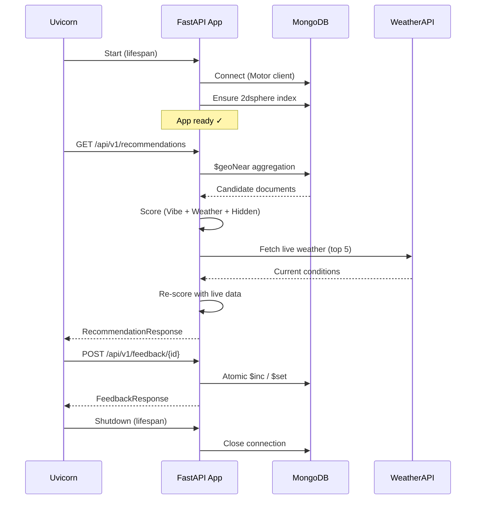

# WATRS v2.0 — Backend Development Report

> **Weather-Aware Tour Recommendation System**
> FastAPI · MongoDB · Motor · Pydantic v2

---

## 1. Project Overview

WATRS v2.0 is a **weather-aware tour recommendation engine** that suggests optimal travel destinations based on the user's geolocation, weather comfort scores, tag-based preferences, and hidden-gem rankings. The backend is a production-ready **FastAPI** application with async MongoDB (Motor), layered security middleware, and a three-phase recommendation pipeline.

---

## 2. Technology Stack

| Layer | Technology | Purpose |
|---|---|---|
| **Framework** | FastAPI ≥ 0.109 | Async REST API with auto-generated OpenAPI docs |
| **Server** | Uvicorn (standard) | ASGI server with hot reload |
| **Database** | MongoDB (via Motor ≥ 3.3) | Async document store with geospatial indexing |
| **Validation** | Pydantic v2 + pydantic-settings | Request/response models & env-based config |
| **HTTP Client** | httpx ≥ 0.27 | Async calls to external weather APIs |
| **Rate Limiting** | SlowAPI + Redis | Per-IP rate limiting (100/min default, 10/min for external API calls) |
| **Security Headers** | `secure` library | HSTS, X-Frame-Options (DENY), CSP (self) |
| **Environment** | python-dotenv | `.env` file parsing |

All dependencies are pinned with version ranges in `requirements.txt`.

---

## 3. Architecture & Folder Structure

```
backend/
├── main.py                   # App entry point, lifespan, router wiring
├── requirements.txt          # Python dependencies
├── .env                      # Environment variables (secrets, DB URL, API keys)
│
├── core/                     # Cross-cutting concerns
│   ├── config.py             # Pydantic-settings based configuration
│   ├── database.py           # DB init (2dsphere index creation)
│   └── security.py           # CORS, rate limiter, secure headers, exception handler
│
├── models/
│   └── place.py              # Pydantic v2 document model (Place, GeoJSON, enums)
│
├── api/
│   └── v1/
│       ├── recommendations.py  # GET /api/v1/recommendations
│       └── feedback.py         # POST /api/v1/feedback/{place_id}
│
├── services/
│   └── recommendation.py     # 3-phase scoring engine (geo → score → live weather)
│
└── scripts/
    ├── seed_smart.py          # DB seeder with real climate data (Open-Meteo API)
    └── recommend_coimbatore.py # CLI verification script for Coimbatore region
```

---

## 4. Core Module (`core/`)

### 4.1 Configuration — `config.py`

- Uses **pydantic-settings** (`BaseSettings`) to load all config from environment variables and `.env`.
- Centralises secrets (`SECRET_KEY`, `MONGODB_URL`, API keys), CORS origins, and rate-limiting settings.
- `cors_origin_list` property parses the comma-separated `CORS_ORIGINS` string into a Python list.
- Singleton pattern via `@lru_cache` ensures only one `Settings` instance per process.

### 4.2 Database Initialisation — `database.py`

- Called once during application startup (via FastAPI lifespan).
- Ensures a **`2dsphere` geospatial index** exists on the `places_live.location` field.
- Idempotent — checks for existing indexes before creating.

### 4.3 Security Middleware — `security.py`

Four security layers are wired in `setup_security(app)`:

| # | Layer | Detail |
|---|---|---|
| 1 | **Rate Limiting** | SlowAPI with Redis backend; default 100 req/min per IP; external-API endpoints capped at 10 req/min |
| 2 | **CORS** | Configurable allowed origins; supports credentials and all standard methods |
| 3 | **Secure Headers** | HSTS (1 year + subdomains), X-Frame-Options DENY, CSP default-src 'self' |
| 4 | **Exception Handler** | Global catch-all returns generic 500 JSON to prevent internal info leakage |

---

## 5. Data Model (`models/place.py`)

The `Place` model maps to documents in the `places_live` MongoDB collection.

### Model Hierarchy

```
Place
├── id (PyObjectId)               — BSON ObjectId ↔ str bridge
├── name, description, image_url  — Core identity fields
├── google_place_id, google_rating, review_count — External references
├── location (GeoJSONPoint)       — { type: "Point", coordinates: [lon, lat] }
├── watrs_tags (List[str])        — Tag-based affinity (e.g. "heritage", "nature")
├── safety_metadata (SafetyMetadata)
│   ├── road_access (RoadAccessLevel enum)  — paved / unpaved / 4wd_only / foot_only / boat_only / off_road
│   ├── safety_rating (SafetyRating enum)   — low / moderate / high
│   ├── notes (optional)
│   └── verified_by_human (bool)
├── metrics (PlaceMetrics)
│   ├── hidden_percentile (0.0–1.0)   — How "hidden" the gem is
│   ├── visit_count
│   ├── avg_rating (0–5)
│   ├── weather_comfort_history (Dict[str, float])  — { "Jan": 0.85, "Feb": 0.90, … }
│   └── community_trust_score (float)
└── created_at, updated_at (auto-managed timestamps)
```

### Key Design Decisions

- **`PyObjectId`**: Custom Annotated type with `BeforeValidator` + `PlainSerializer` for seamless BSON ↔ JSON conversion.
- **`GeoJSONPoint`**: Strict `[lon, lat]` validation matching MongoDB's `2dsphere` requirements.
- **`to_mongo()`**: Serialises for insertion, excluding `_id` so MongoDB auto-assigns it.

---

## 6. API Endpoints (`api/v1/`)

### 6.1 Recommendations — `GET /api/v1/recommendations`

| Parameter | Type | Default | Description |
|---|---|---|---|
| `lat` | float | required | Latitude (-90 to 90) |
| `lon` | float | required | Longitude (-180 to 180) |
| `radius_km` | float | 10.0 | Search radius in km (max 500) |
| `tags` | string | optional | Comma-separated preference tags |

**Rate limit**: 10 requests/minute (calls external Weather API).

**Response** (`RecommendationResponse`):
```json
{
  "results": [
    {
      "place": { /* Place object */ },
      "score": 0.4821,
      "dist_meters": 12500.0,
      "weather_fallback": false
    }
  ],
  "total_candidates": 8,
  "warnings": []
}
```

### 6.2 Feedback — `POST /api/v1/feedback/{place_id}`

| Action | MongoDB Update | Effect |
|---|---|---|
| `like` | `$inc community_trust_score +0.1` | Boosts place ranking |
| `dislike` | `$inc community_trust_score -0.1` | Lowers place ranking |
| `safety_alert` | `$set verified_by_human = false` | Flags for human safety review |

- Validates `place_id` as a valid BSON ObjectId.
- Returns 404 if the place doesn't exist.
- Rate-limited to 10 req/min to prevent vote manipulation.

---

## 7. Recommendation Engine (`services/recommendation.py`)

The engine implements a **three-phase pipeline**:

### Phase 1 — Geospatial Filter (`$geoNear`)

- Uses MongoDB's `$geoNear` aggregation with `2dsphere` indexing.
- Converts `radius_km` to metres for the `maxDistance` parameter.
- Returns all candidate documents with a computed `dist_meters` field.

### Phase 2 — Weighted Scoring

Each candidate is scored using the formula:

```
S(L) = 0.4 × Vibe + 0.3 × Weather + 0.3 × Hidden
```

| Component | Weight | Calculation |
|---|---|---|
| **Vibe** (V) | 0.4 | Jaccard similarity between user tags and place tags |
| **Weather** (C) | 0.3 | Current month's comfort from `weather_comfort_history` |
| **Hidden** (H) | 0.3 | `hidden_percentile` value (0 = popular, 1 = very hidden) |

**Hard-failure filters** (place is excluded):
- `road_access == "boat_only"` (inaccessible)
- Weather comfort score < 0.4

### Phase 3 — Live Weather Validation (Top 5)

- Calls **WeatherAPI.com** (`current.json`) for the top 5 scored candidates.
- Derives a live comfort score: `clamp(1.0 - |temp - 22| / 28, 0, 1)`, halved for adverse conditions (rain, thunderstorm, etc.).
- **Circuit breaker**: 2-second timeout; falls back to stored monthly history if the API is unavailable.
- Re-scores and re-sorts after live weather adjustment.

---

## 8. Scripts (`scripts/`)

### 8.1 Database Seeder — `seed_smart.py`

- Seeds **10 unique Tamil Nadu destinations** (Meghamalai, Javadi Hills, Pollachi, Sirumalai, Yelagiri, Kotagiri, Manjolai, Coonoor, Theni, Dhanushkodi).
- Fetches **real historical climate data** from the Open-Meteo Archive API (2023 full year).
- Calculates monthly comfort scores using a weighted formula: `0.5 × TempScore + 0.5 × RainScore`.
- Skips already-seeded places (idempotent).
- Prints a verification table (Jan/Feb/May/Oct comfort scores) after seeding.

### 8.2 Verification Script — `recommend_coimbatore.py`

- Standalone CLI tool to test the recommendation pipeline against MongoDB directly.
- Runs a `$geoNear` query from Coimbatore (500 km radius).
- Filters for Jan/Feb comfort > 0.8, prioritises hidden gems (percentile > 0.7).
- Prints a formatted results table with place name, month, comfort score, distance, and reason tags.

---

## 9. Environment Configuration (`.env`)

| Variable | Purpose |
|---|---|
| `SECRET_KEY` | JWT signing key |
| `MONGODB_URL` | MongoDB connection string |
| `WEATHERAPI_API_KEY` | WeatherAPI.com key for live weather |
| `GOOGLE_PLACES_API_KEY` | Google Places API key |
| `CLOUDINARY_URL` | Cloud image storage |
| `REDIS_URL` | Redis URL for rate-limiting state |
| `CORS_ORIGINS` | Comma-separated allowed frontend origins |

---

## 10. Application Lifecycle



---

## 11. Summary of Work Completed

| Area | Work Done |
|---|---|
| **App scaffolding** | FastAPI app with async lifespan, versioned router structure (`/api/v1/`) |
| **Configuration** | Centralised env-based settings with pydantic-settings and `.env` support |
| **Data modelling** | Full Pydantic v2 document model with GeoJSON, enums, and BSON ObjectId bridging |
| **Geospatial indexing** | Automated `2dsphere` index creation on startup |
| **Security** | Rate limiting (SlowAPI + Redis), CORS, HSTS, CSP, X-Frame-Options, global exception handler |
| **Recommendation engine** | 3-phase pipeline (geo filter → weighted scoring → live weather validation) |
| **Community feedback** | Atomic like/dislike/safety-alert with trust score updates |
| **Database seeding** | Smart seeder with real climate data from Open-Meteo API for 10 Tamil Nadu destinations |
| **Verification tooling** | CLI script for testing recommendations against live MongoDB data |
| **External API integration** | WeatherAPI.com with circuit breaker (2s timeout + fallback to historical data) |
